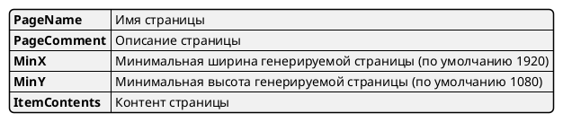
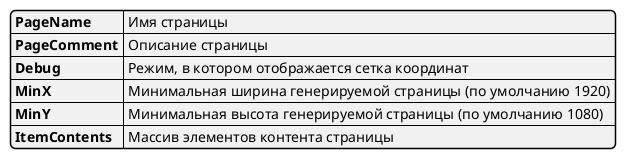
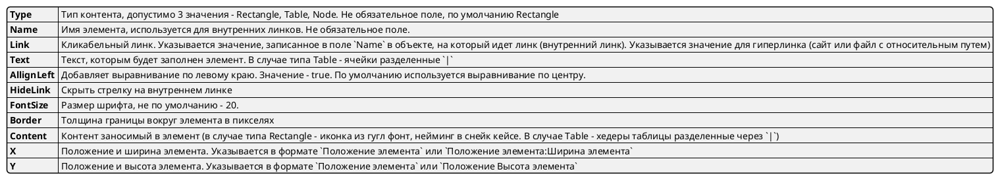

# uaml (ui mockup as yaml code) 

Данная утилита позволяет создавать кликабельные pdf-мокапы из yaml файлов.

Имеет простой веб-интерфейс для ознакомления и OpenApi запросы для интеграции с другими решениями.
В планах реализация плагинов vscode и docsify.

## Развертывание

```bash
docker build -f .\yaml-moq\Dockerfile -t uaml .
docker run -p 80:80 -d --name uaml uaml:latest
```

## Общее описание страницы пдф



## Описание контента

Описание родительского объекта



Описание дочернего элемента контента страницы


