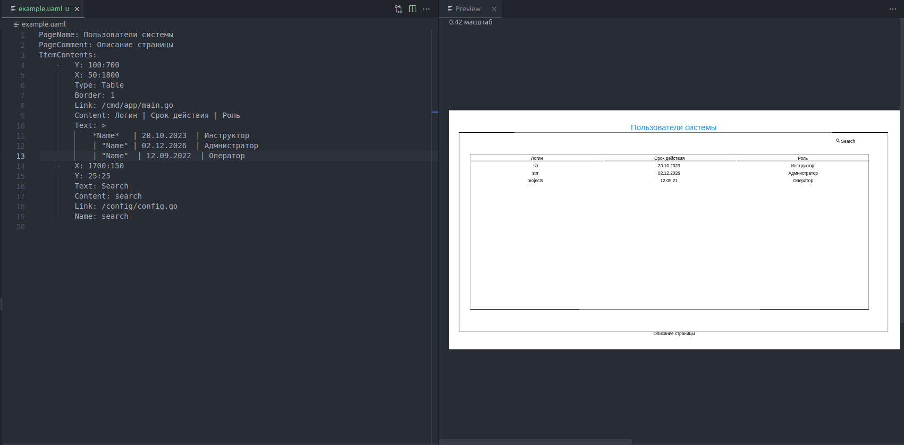
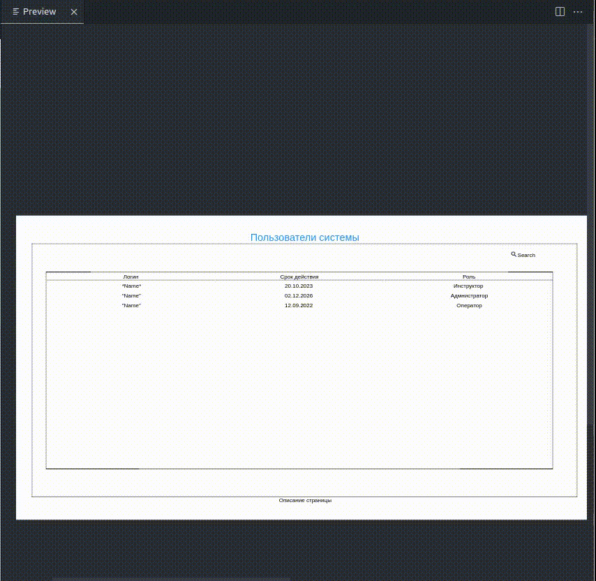
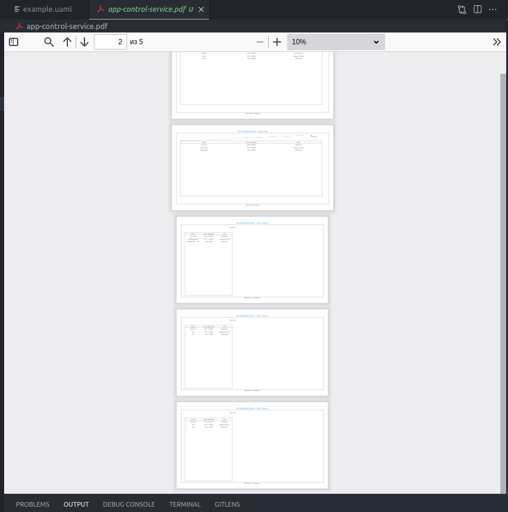

# uaml-consumer

Плагин позволяющий комфортно работать с мокапами описанной документации в среде VS Code. Утилита выполняющая функцию создания кликабельных мокапов позволяет плагину отображать ваши документы в окне предварительного просмотра. 

## Features

- окно предварительного просмотра для наглядного отображения вашей описанной документации

- удобное перемещение по окну предварительному просмотру

- генерация pdf файла, который содержит страницы всех `uaml` файлов

- перемещение по рабочей директории с помощью относительных ссылок в предварительном окне просмотра

## Requirements

Для комфортной работы рекомендуется установить `vscode-pdf` 

## Extension Settings

* `uamlConsumer.server.uri`: Базовый URI uaml-сервера для доступа к утилите **uaml**
* `uamlConsumer.server.optional.headers`: Заголовки для обращения к **uaml** 
* `uamlConsumer.login`: Логин для доступа к сервису
* `uamlConsumer.password`: Пароль для доступа к сервису

## Known Issues

<---------------->

## Release Notes

<----------------->

### 0.3.0

Первый релиз на маркетплейс VS Code. 
